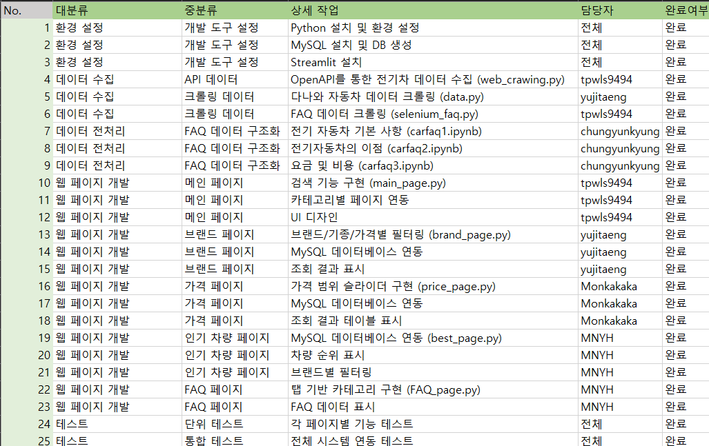
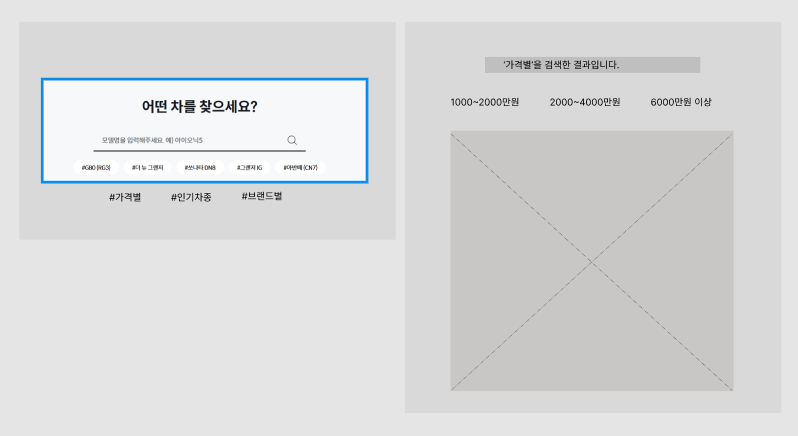
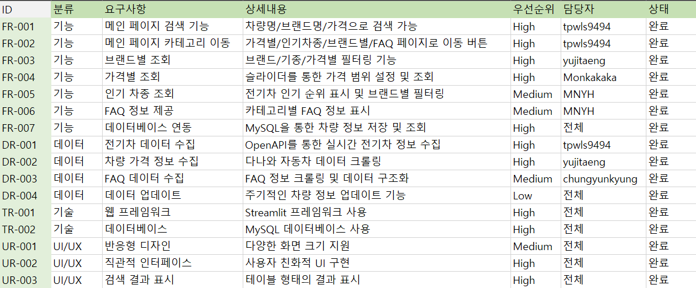
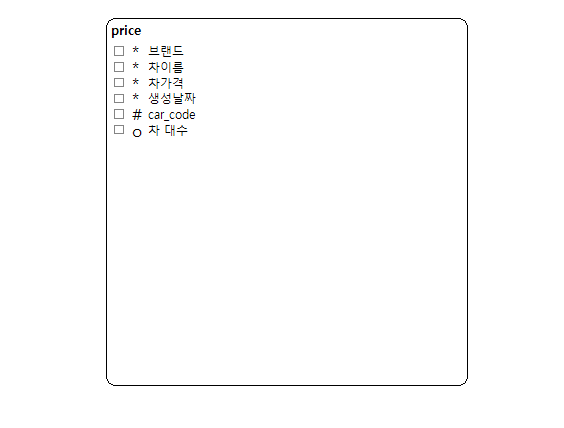
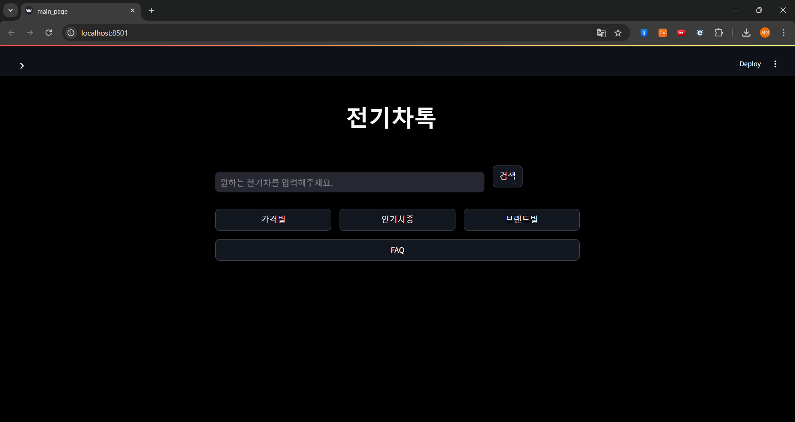
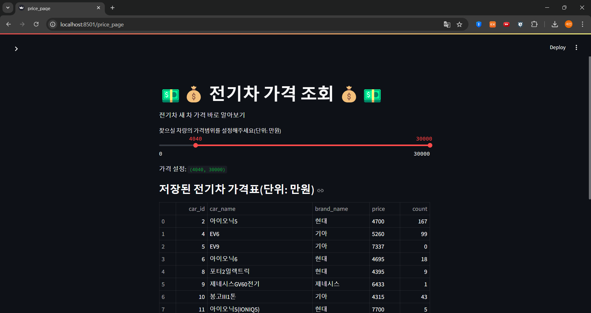
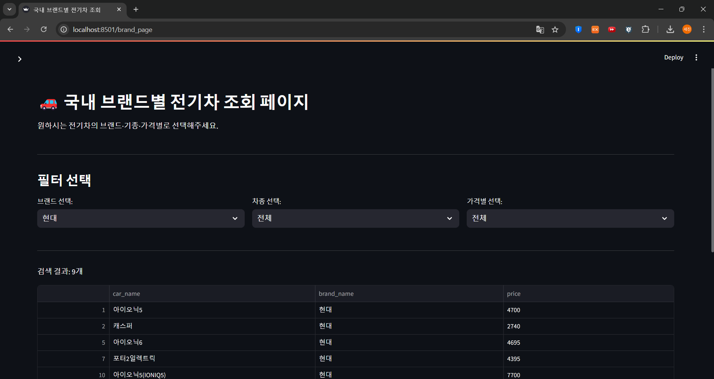
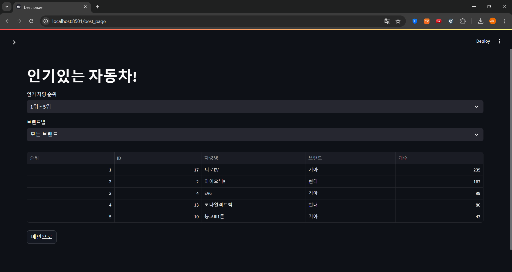
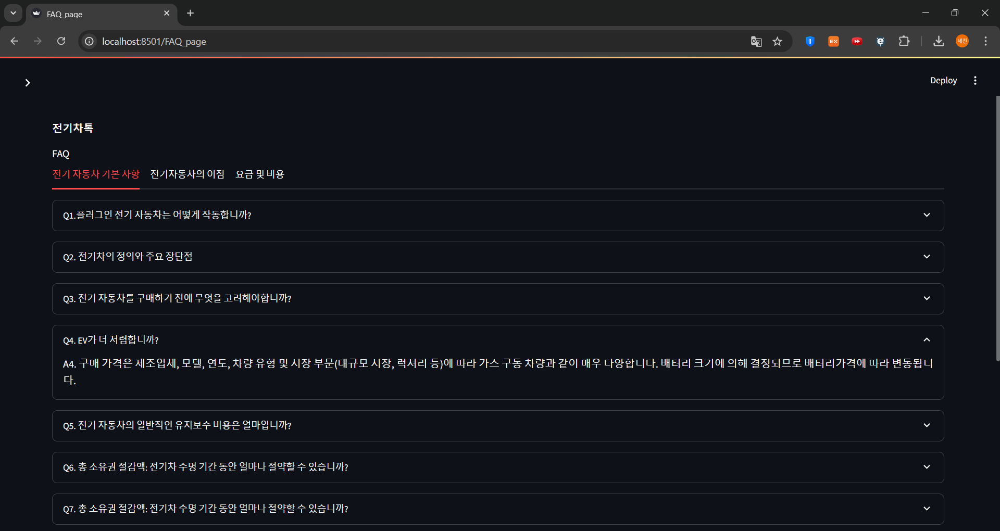

# SKN09-1st-4Team

 

# 0. Introduction Team (팀 소개)

### ✅ 팀명 : 살려🐔

<table align=center>
<tbody>
<tr>
<td align=center><b>유지은</b></td>
<td align=center><b>윤환</b></td>
<td align=center><b>이세진</b></td>
<td align=center><b>정윤경</b></td>
<td align=center><b>최재동</b></td>
</tr>
<tr>
<td align="center">

</td>
<td align="center">

</td>
<td align="center">

</td>
<td align="center">

</td>
<td align="center">

</td>
</tr>
<tr>
<td><a href="https://github.com/yujitaeng">
@yujitaeng
</a></td>
<td><a href="https://github.com/MNYH">
@MNYH
</a></td>

<td><a href="https://github.com/tpwls9494">
@tpwls9494
</a></td>
<td><a href="https://github.com/chungyunkyung">
@chungyunkyung
</a></td>

<td><a href="https://github.com/Monkakaka">
@Monkakaka
</a></td>
</tr>
</tbody>
</table>

   

# 1. Introduction Project (프로젝트 개요)

### ✅프로젝트 명

전기차톡(전톡)

### ✅프로젝트 소개

전기차톡은 국내 전기 자동차 시장의 종합 정보를 제공하는 조회 플랫폼입니다. 

사용자들은 본 플랫폼을 통해 국내에서 판매되는 모든 전기차 브랜드와 모델의 정보를 한눈에 확인할 수 있습니다. 

### ✅프로젝트 필요성(배경)

최근 몇 년간 국내 전기차 시장은 급격한 성장세를 보이고 있습니다. 이러한 시장 변화에 따라 다음과 같은 요구사항이 증가하고 있습니다:

1. 통합적인 정보 접근성 필요
    - 분산되어 있는 전기차 관련 정보의 통합
    - 실시간 업데이트되는 가격 및 정책 정보 제공
2. 데이터 기반 의사결정 지원
    - 소비자들의 합리적인 구매 결정 지원
    - 객관적인 비교 분석 데이터 제공
3. 시장 투명성 확보
    - 정확하고 신뢰할 수 있는 정보 제공
    - 표준화된 정보 체계 구축

### ✅프로젝트 목표

- 사용자 중심의 정보 플랫폼 구축
    - 직관적이고 사용하기 쉬운 인터페이스 제공
    - 맞춤형 검색 및 필터링 기능 구현
- 데이터 신뢰성 확보
    - 실시간 데이터 업데이트 시스템 구축
    - 공신력 있는 데이터 소스 확보 및 검증 체계 수립
- 시장 발전 기여
    - 전기차 시장의 정보 비대칭성 해소
    - 소비자의 합리적 선택 지원
    - 전기차 보급 활성화에 기여
- 지속 가능한 플랫폼 운영
    - 사용자 피드백 기반의 지속적인 서비스 개선
    - 데이터 품질 관리 체계 구축

 

### 👤페르소나

1. **메인 페르소나:**
    이름: **김준서 (35세, 금융권 과장)**
  - **특징**:
      - 첫 아이 출산을 앞둔 예비 아빠로, 가족을 위한 안전하고 실용적인 전기차를 찾는 중
      - 재테크와 자산관리에 관심이 많아 전기차 구매의 경제성을 꼼꼼히 따져봄
      - 차량 구매 시 동료들과 온라인 커뮤니티의 의견을 적극 참고함
      - 주중 출퇴근과 주말 가족 나들이를 고려한 실용적인 차량 선호
      - 자동차 관련 유튜브와 블로그를 통해 연령대별 구매 트렌드를 분석하는 편
  - **목표**:
      - 30대 남성들이 선호하는 전기차 브랜드와 모델을 파악하고 싶음
      - 가성비와 실용성을 모두 갖춘 전기차를 찾고 싶음
      - 같은 연령대 직장인들의 구매 경험과 만족도를 참고하고 싶음
      - 전기차 브랜드별 잔존가치와 유지비용을 비교하고 싶음
  - **주요 관심사**:
      - 동일 연령대 남성들의 전기차 선호 브랜드와 구매 결정 요인
      - 전기차의 경제성과 실용성 분석
      - 가족용 전기차로서의 적합성과 안전성
      - 직장 동료들과 온라인 커뮤니티의 실제 사용 후기
        
2. **서브 페르소나:**
    이름: **박지현 (32세, IT기업 프로젝트 매니저)**
  - **특징**:
      - 최근 결혼을 앞두고 있는 워킹우먼으로, 신혼 차량으로 전기차를 고려 중
      - 디지털 기기와 친숙하며 새로운 기술 트렌드에 민감함
      - 차량 구매 시 동년배들의 선호도와 트렌드를 중요하게 생각함
      - 출퇴근 및 주말 여행을 위한 실용적인 차량을 찾고 있음
      - SNS와 자동차 커뮤니티에서 연령대별, 성별 구매 데이터를 적극적으로 찾아보는 편
  - **목표**:
      - 30대 여성들이 선호하는 전기차 브랜드와 모델을 파악하고 싶음
      - 동일 연령대의 구매 후기와 만족도를 확인하고 싶음
      - 성별, 연령별 구매 통계를 바탕으로 객관적인 구매 결정을 하고 싶음
      - 전기차 브랜드별 인기 모델의 장단점을 비교하고 싶음
  - **주요 관심사**:
      - 같은 연령대가 선호하는 전기차 브랜드와 구매 이유
      - 성별에 따른 전기차 선호도 차이와 그 이유
      - 전기차 브랜드별 연령대 타겟층과 마케팅 전략
      - 구매 전 고려해야 할 실제 사용자들의 경험담

   

# 2. Tech Stack (기술 스택)

>  Co-Work Tool 
> 

<table>
<tr>
<td>Communication & Messenger</td>
<td></td>
<td></td>
</tr>
<tr>
<td>Development & Merge</td>
<td></td>
<td></td>
</tr>
</table>
 

>  Streamlit 
> 

<table>
<tr>
<td>VScode</td>
<td></td>
<td></td>
</tr>
</table>
 

>  Data Server 
> 

<table>
<tr>
<td>RDBMS</td>
<td></td>
</tr>
</table>
   

# 3. WBS

   

### Data Frame

   

# 4. 요구사항 명세서

   

# 5. ERD

   

# 6. 수행결과(시연 페이지)

### Main Page

   

### Search

User1: “4000만원대 이상의 차를 보여줘”

  

User2: “현대 전기 자동차 종류는 뭐가 있어?”

  

User3: “아이오닉5는 잘 팔리나?”

  

### FAQ Page

   

# 7. 한 줄 회고

😜<b>유지은</b>

*無에서 시작해서 有를 만들어 낼 수 있게 되었습니다. 도와주신 팀원분들과 ‘제 의지’에 박수를 칩니다. 🥹👏* 

☠️<b>윤환</b>

*DB 연동 및 크롤링을 진행하며, 많은 실패와 에러를 경험했습니다. 점점 익숙해 지고 있다는 생각에 매우 기쁩니다.* 

🔥<b>이세진</b>

*python으로 프로젝트를 시행하는 건 처음이라 selenium이라는 개념을 배우고 프로젝트에서 활용하기가 어렵다는 것을 다시 한번 깨달았습니다.* 

🐦‍🔥<b>정윤경</b>

*1일 1코드 복습 또 복습이네.* 

🐴<b>최재동</b>

*분명이 배운 부분임에도 많이 놓치고 헤매는 부분이 많았습니다. 더욱 더 정진하여 목표를 향해 달려나가도록 하겠습니다.* 
